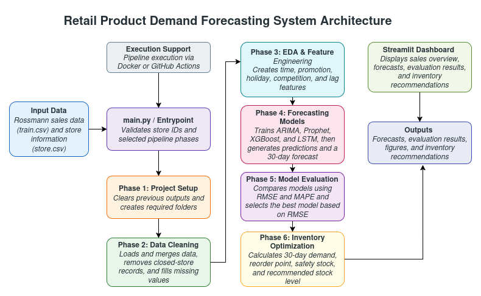
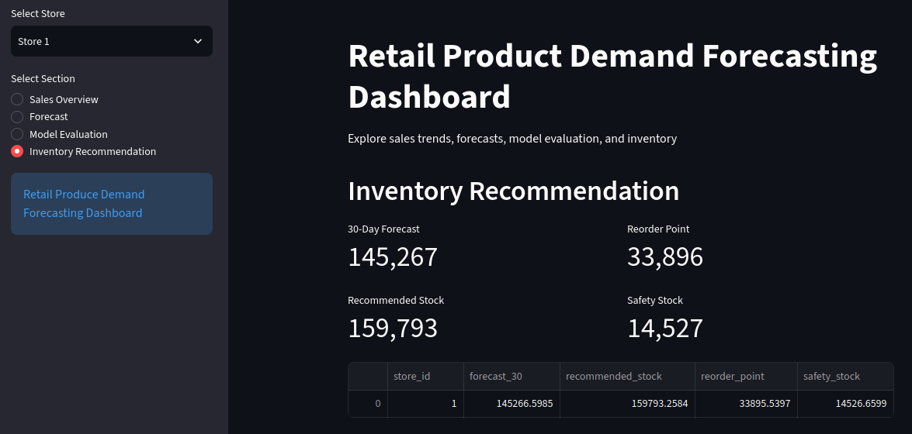

# Retail Product Demand Forecasting System
The Retail Product Demand Forecasting System is an **end-to-end machine learning pipeline** that predicts retail sales demand and optimizes inventory management using the [Rossmann Store Sales](https://www.kaggle.com/competitions/rossmann-store-sales/data) dataset. It implements ARIMA, Prophet, XGBoost, and LSTM models, evaluates performance with RMSE and MAPE, and generates inventory recommendations (reorder points, safety stock, and recommended stock levels). The system is modular, Dockerized, and includes a Streamlit dashboard for visualization.

Key features include:
- **Multi-Model Forecasting**: Compares ARIMA, Prophet, XGBoost, and LSTM for sales prediction.
- **Data Preprocessing**: Handles missing values, closed stores, and feature engineering (time-based, promotional, holiday, and competition features).
- **Exploratory Data Analysis**: Visualizes sales distributions, seasonality, and peaks to identify patterns.
- **Model Evaluation**: Uses RMSE and MAPE to compare forecasting model performance.
- **Inventory Optimization**: Generates 30-day forecasts, reorder points, safety stock, and recommended stock levels.
- **Modular Pipeline**: Six-phase workflow (setup, cleaning, EDA, forecasting, evaluation, inventory optimization).
- **Containerization & CI/CD**: Dockerized with GitHub Actions for workflow automation.
- **Streamlit Dashboard**: Interactive UI for sales, forecasts, model comparisons, and inventory recommendations.
- **Logging & Error Handling**: Comprehensive logging for debugging and monitoring.


## Key Results
- **Model Evaluation (Store 1)**:
  - **ARIMA**: RMSE = **873.48**, MAPE = **17.49%**.
  - **Prophet**: RMSE = **850.16**, MAPE = **16.40%**.
  - **XGBoost**: **The best-performing model** (RMSE = **464.25**, MAPE = **8.55%**).
  - **LSTM**: RMSE = **819.26**, MAPE = **15.80%**.

- **Inventory Recommendations (Store 1)**:
  - **30-Day Forecasted Demand**: **145 266.60**.
  - **Average Daily Demand**: **4 842.22**.
  - **Reorder Point**: **33 895.54** (7-day lead time).
  - **Safety Stock**: **14 526.66** (3× average daily demand).
  - **Recommended Stock Level**: **159 793.26**.

- **Business Impact**:
  - XGBoost **captures promotions, seasonality, and demand fluctuations** better than other models.
  - Forecast-based planning **reduces stockout risks** and **optimizes inventory costs**.


## Tech Stack
- **Language**: Python
- **Data Processing**: Pandas, NumPy
- **Machine Learning**: Scikit-learn, XGBoost
- **Time-Series Forecasting**: Statsmodels (ARIMA), Prophet
- **Deep Learning**: TensorFlow/Keras (LSTM)
- **Visualization & Dashboard**: Matplotlib, Plotly, Streamlit
- **Deployment & Automation**: Docker, GitHub Actions (CI/CD)


## Dataset
This project uses the [**Rossmann Store Sales**](https://www.kaggle.com/competitions/rossmann-store-sales/data) dataset, a public Kaggle forecasting competition dataset, containing daily sales records from 1,115 stores over approximately two years, including store metadata, promotions, and holiday information.


## System Architecture


> The system follows a modular, six-phase pipeline designed for scalability and maintainability. Each phase, including project-setup, data cleaning, EDA, forecasting, model evaluation, and inventory optimization, operates independently, enabling flexible execution and testing. The pipeline is containerized using Docker for consistency across environments and integrated with GitHub Actions for automated CI/CD. A Streamlit dashboard provides an interactive interface to visualize forecasts, model comparisons, and inventory recommendations.


### Pipeline Overview
- **Phase 1: Project Setup** - Initializes the directory structure for outputs (data, figures, logs).
- **Phase 2: Data Cleaning** - Merges, cleans, and preprocesses raw sales and store datasets.
- **Phase 3: EDA** - Analyzes sales patterns, seasonality, and peaks via visualizations.
- **Phase 4: Forecasting Models** - Trains ARIMA, Prophet, XGBoost, and LSTM for demand prediction.
- **Phase 5: Model Evaluation** - Compares models using RMSE and MAPE metrics.
- **Phase 6: Inventory Optimization** - Generates reorder points, safety stock, and stock level recommendations.


## Exploratory Data Analysis

### Sales Distribution


### Daily Sales


### Monthly Sales


### Model Comparison

#### RMSE Comparison


#### MAPE Comparison


### Best Model Forecast (XGBoost)


## Streamlit Dashboard



## Quick Start

### Prerequisites
- Clone the repository (required for [Source Installation](#source-installation) only):
	```bash
	git clone https://github.com/vasimvahabov/retail-product-demand-forecasting-system.git
	  
	# move to the working directory
	cd retail-product-demand-forecasting-system/
 	```

- Create the output and log directories in the workspace:
	```bash
	mkdir -p out log
	```


### Source Installation

- [Run from Source (Python)](#run-from-source-python)
- [Run from Source (Docker)](#run-from-source-docker)

#### Run from Source (Python)
     
- Create a virtual environment:
	```bash
	python3 -m venv venv
	```

- Activate the virtual environment:
	```bash
	# On macOS/Linux
	source venv/bin/activate
	
	# On Windows:
	venv\Scripts\activate
	```

- Install the required dependencies:
	```bash 
	pip install -r requirements.txt
	```
	
	- Run the pipeline:
	```bash
	python src/main.py --stores 1 --all-phases 
	```
	> **Note:** Run `python src/main.py --help` for more details.


- Run the Streamlit application:
	```bash
	streamlit run src/main.py -- --stores 1  
	```
> **Note:**
>- Pipeline artifacts should be present to run the Streamlit application for specified store(s).
>- The app will open in your browser at `http://localhost:8501/`.
>- Allow some time for the visualizations to load, depending on the selected store(s).


#### Run from Source (Docker)
- Build the Docker Image:
	```bash
	IMAGE_TAG="$(date +%s)"
	docker build -t "retail-product-demand-forecasting-system:$IMAGE_TAG" .
	```


- Run the pipeline in the built Docker container with mounted log and output directories:
	```bash
	docker run -e EXECUTION_CMD="python src/main.py --stores 1 --all-phases" \
		-v $(pwd)/out:/app/out \
		-v $(pwd)/log:/app/log \
		"retail-product-demand-forecasting-system:$IMAGE_TAG"
	```
	> **Note:** Pass `EXECUTION_CMD` as `python src/main.py --help` for more details.


- Run the Streamlit application in the Docker container with mounted log and output directories:
	```bash
	docker run -e EXECUTION_CMD="streamlit run src/main.py -- --stores 1" \
		-v $(pwd)/out:/app/out \
		-v $(pwd)/log:/app/log \
		retail-product-demand-forecasting-system:$(date +%s)
	```
> **Note:**
>- Pipeline artifacts should be present to run the Streamlit application for specified store(s).
>- The app will print URLs (Local, Network, External) in the terminal. Use the Local URL to access the app in your browser.
>- Allow some time for the visualizations to load, depending on the selected store(s).


### Run with Prebuilt Docker Image

- Pull the prebuilt Docker image from GitHub Container Registry:
	```bash
	docker pull ghcr.io/vasimvahabov/retail-product-demand-forecasting-system:latest
	```


- Run the pipeline using the prebuilt Docker image with mounted log and output directories:
	```bash
	docker run -e EXECUTION_CMD="python src/main.py --stores 1 --all-phases" \
		-v $(pwd)/out:/app/out \
		-v $(pwd)/log:/app/log \
		ghcr.io/vasimvahabov/retail-product-demand-forecasting-system:latest
	```


- Run the Streamlit application using the prebuilt Docker image with mounted log and output directories:
	```bash
	docker run -e EXECUTION_CMD="streamlit run src/main.py -- --stores 1" \
		-v $(pwd)/out:/app/out \
		-v $(pwd)/log:/app/log \
		ghcr.io/vasimvahabov/retail-product-demand-forecasting-system:latest
	```
> **Note:**
>- Pipeline artifacts should be present to run the Streamlit application for specified store(s).
>- The app will print URLs (Local, Network, External) in the terminal. Use the Local URL to access the app in your browser.
>- Allow some time for the visualizations to load, depending on the selected store(s).


## Pipeline Outputs

### Figures
- **`store_{id}_daily_sales.png`** — Daily sales time series for a store.
- **`store_{id}_weekday_pattern.png`** — Average sales by weekday.
- **`store_{id}_monthly_sales.png`** — Monthly sales patterns for a store.
- **`store_{id}_sales_peaks.png`** — Sales peaks above the 95th percentile.
- **`sales_distribution.png`** — Sales distribution histogram for the merged dataset.
- **`store_{id}_arima_forecast.png`** — ARIMA forecast versus actual sales.
- **`store_{id}_prophet_forecast.png`** — Prophet forecast versus actual sales.
- **`store_{id}_xgboost_forecast.png`** — XGBoost forecast versus actual sales.
- **`store_{id}_lstm_forecast.png`** — LSTM forecast versus actual sales.
- **`store_{id}_model_comparison_rmse.png`** — RMSE comparison across models.
- **`store_{id}_model_comparison_mape.png`** — MAPE comparison across models.


### Data Files
- **`sales_data_cleaned.csv`** — Cleaned and merged sales and store dataset.
- **`store_{id}_eda.csv`** — Processed EDA features for a specific store.
- **`store_{id}_forecasts.csv`** — Forecasts from all models (ARIMA, Prophet, XGBoost, LSTM) for a store.
- **`store_{id}_forecast_30.csv`** — 30-day forecast for a store.
- **`store_{id}_evaluation.csv`** — Model evaluation metrics (RMSE, MAPE) for a store.
- **`store_{id}_inventory.csv`** — Inventory recommendations (reorder point, safety stock, recommended stock level) for a store.


## CI/CD
GitHub Actions automatically generate and persist pipeline artifacts in the **ci/output** branch.

Generated artifacts include:
- `out/data` — Processed datasets and forecasting results.
- `out/figures` — Exploratory analysis and model evaluation plots.
- `log` — Pipeline execution logs.
> These artifacts are used by the README examples and Streamlit dashboard visualization.


## Logging
Each pipeline execution creates a **timestamped log file** in the **log** directory and prints logs to the terminal.
